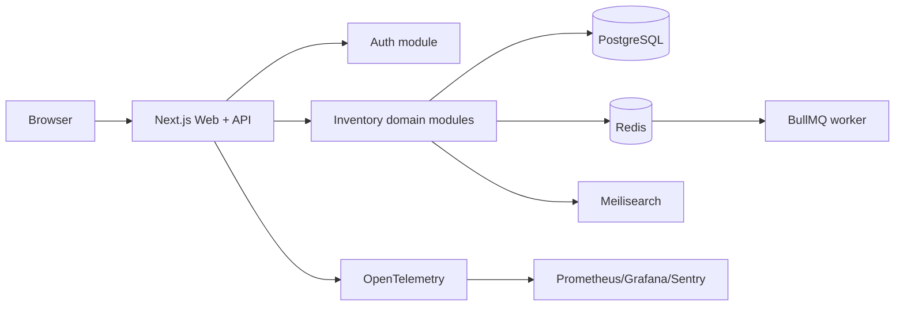

# StockSense System Architecture

## 1. Architecture decision

Use a **modular monolith**: one deployable Next.js application with explicit domain modules and a shared PostgreSQL database. This keeps stock mutations transactionally simple while leaving clear seams for workers and future services.

## 2. Modules

- **Identity:** sign-up, sign-in, sessions, OTP recovery, roles.
- **Catalog:** products, categories, UOM, costs, thresholds.
- **Facilities:** warehouses and locations.
- **Inventory:** stock levels, reservations, availability.
- **Operations:** receipts, deliveries, transfers, adjustments, state transitions.
- **Ledger:** append-only stock moves and audit queries.
- **Dashboard:** KPI aggregation and filtered operational summaries.
- **Search/Notifications:** SKU/contact search and reorder alerts.
- **Reporting:** asynchronous exports and scheduled reports.

Modules communicate through application services, not direct cross-module UI/database access. All stock-changing commands use a single transaction boundary.

## 3. Request flow

1. Authenticate session and authorize role/action.
2. Parse request with Zod and enforce business invariants.
3. Begin database transaction; lock affected stock rows.
4. Re-check availability and lifecycle state.
5. Update stock levels and append ledger rows atomically.
6. Emit an outbox/job event after commit for alerts, search indexing, and reporting.
7. Return a stable resource representation with correlation ID.

## 4. Deployment baseline

- Web/API container behind Caddy or a managed reverse proxy.
- Managed PostgreSQL with PgBouncer; Redis for BullMQ and rate limits.
- Meilisearch is optional and can be introduced after PostgreSQL search is insufficient.
- Use OpenTofu for infrastructure; Kubernetes is an escalation, not a default.
- Environments: local, CI, staging, production. Production deploys are immutable and canary/feature-flagged when needed.

## 5. Security boundaries

Secrets are injected at runtime; no secrets in source or images. Passwords are hashed with a memory-hard password hash. Cookies are Secure, HttpOnly, SameSite, and scoped narrowly. Rate-limit login, OTP, search, and mutation endpoints. Apply least privilege at role and facility scope.

## 6. Reliability and scale

Start with PostgreSQL + BullMQ. Introduce Redis-backed queues for reorder alerts and reports. Escalation paths are: single app → app + worker → separate services, and PostgreSQL → pgvector → dedicated vector DB only when measured requirements justify it.

## 7. Observability

Instrument HTTP, database, queue, and stock-validation spans with OpenTelemetry. Track request latency, validation failures, stock conflicts, queue lag, DB saturation, login failures, and ledger write errors. Logs are structured JSON with correlation ID and no credentials or sensitive OTP values.
